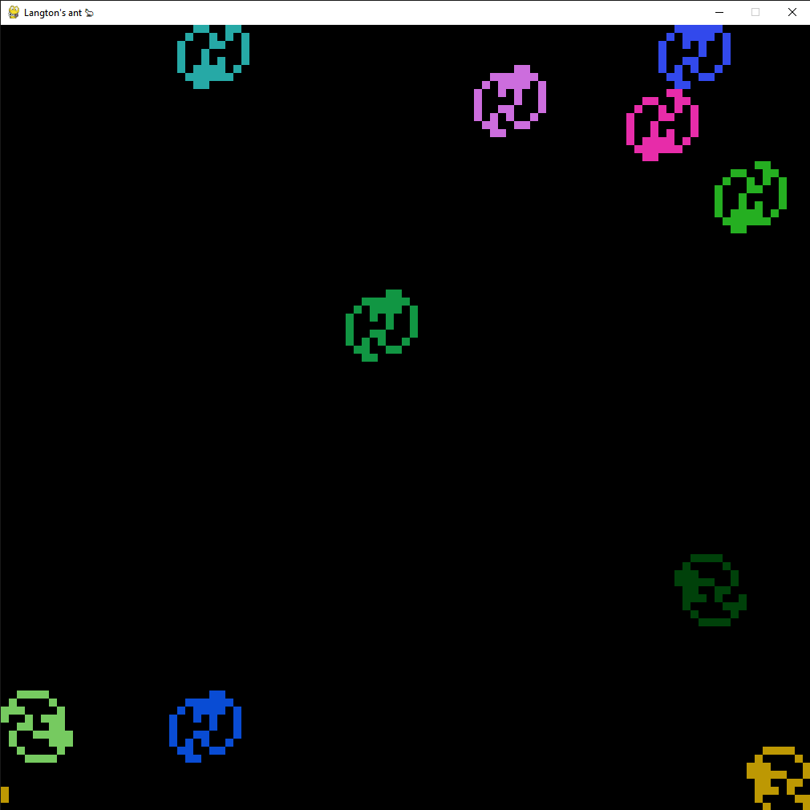

# Langton's ant

## What is it?
**Langton's ant** is a **two-dimensional** Turing machine with a very simple set of rules but complex emergent behavior. It was invented by **Chris Langton in 1986** and runs on a square lattice of black and white cells.The idea has been generalized in several different ways, such as turmites which add **more colors** and **more states**.  

## Rules
Squares on a plane are colored variously either black or white. We arbitrarily identify one square as the **"ant"**. The ant can travel in any of the **four cardinal directions** at each step it takes. **The "ant" moves according to the rules below**:

- At a **white** square, turn 90° clockwise, flip the color of the square, move forward one unit
- At a **black** square, turn 90° counter-clockwise, flip the color of the square, move forward one unit

### More detailed information can be found at this [Wikipedia](https://en.wikipedia.org/wiki/Langton%27s_ant) link